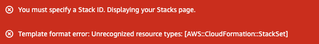

>ℹ️&nbsp;&nbsp;SignalFx was acquired by Splunk in October 2019. See [Splunk SignalFx](https://www.splunk.com/en_us/investor-relations/acquisitions/signalfx.html) for more information.

# Overview

These are CloudFormation templates to deploy customer side AWS infrastructure required to utilize the full functionality of AWS integration offered by Splunk Observability Backend.

Deployment of this template is a single step when setting up AWS integration in Splunk Observability. There are more steps required to successfully send logs and metrics to Splunk Observability.

## AWS StackSets
Some of our templates utilize StackSets, which allow for deployment of resources across a few regions with a single StackSet deployment.
 
 StackSets require [prerequisites](https://docs.aws.amazon.com/AWSCloudFormation/latest/UserGuide/stacksets-prereqs-self-managed.html) to be configured. (this is required one time per AWS account). 
 
 Unfortunately, not all regions support StackSets (not every region can be a "parent" region of a StackSet). If you try to open a template containing StackSet in a region which does not support it you will see an error similar to:

 

## Choosing the right template

We recommend the usage of [the latest template containing all features](https://console.aws.amazon.com/cloudformation/home?region=eu-central-1#/stacks/create/review?templateURL=https://o11y-public.s3.amazonaws.com/aws-cloudformation-templates/release/template_all_features.yaml) which uses StackSets to deploy across all regions. 

The template utilizes StackSets to help deploy infrastructure for collecting logs via forwarding lambda and collecting metrics utilizing AWS CloudWatch Metric Streams.
Even if you don't intend to use both functionalities, you can safely deploy this template - unused infrastructure will not generate costs.

In order to use StackSets, make sure to configure the [prerequisites](https://docs.aws.amazon.com/AWSCloudFormation/latest/UserGuide/stacksets-prereqs-self-managed.html) (this is required one time per AWS account).

If you can't or don't want to deploy the recommended template in your environment, please use one of the alternatives. If you are not sure what values to use as Parameters, please see last section.

| Template        (do not deploy; use only for source inspection)                                           | Log collection | Metric Streams  | Deployment type |  QuickLink (click and adjust the region in AWS Console) | Hosted template link| Gov/China compatibility
| --------------------------------------------------------- |:--------------:| :--------------:| --------------- | ----------|----------------------|------|
| [all features (using StackSets)](latest/template_all_features.yaml)                             | yes            | yes             |once per account (utilizing StackSets)|[deploy this](https://console.aws.amazon.com/cloudformation/home?region=eu-central-1#/stacks/create/review?templateURL=https://o11y-public.s3.amazonaws.com/aws-cloudformation-templates/release/template_all_features.yaml)|https://o11y-public.s3.amazonaws.com/aws-cloudformation-templates/release/template_all_features.yaml|no
| [all features](latest/template_all_features_regional.yaml) | yes            | yes             |in each region |[deploy this in every region](https://console.aws.amazon.com/cloudformation/home?region=eu-central-1#/stacks/create/review?templateURL=https://o11y-public.s3.amazonaws.com/aws-cloudformation-templates/release/template_all_features_regional.yaml)|https://o11y-public.s3.amazonaws.com/aws-cloudformation-templates/release/template_all_features_regional.yaml|no
| [logs (using StackSets)](logs/template_logs.yaml)                                  | yes            | no              |once per account (utilizing StackSets)|[deploy this](https://console.aws.amazon.com/cloudformation/home?region=eu-central-1#/stacks/create/review?templateURL=https://o11y-public.s3.amazonaws.com/aws-cloudformation-templates/release/template_logs.yaml)|https://o11y-public.s3.amazonaws.com/aws-cloudformation-templates/release/template_logs.yaml|no
| [logs](logs/template_logs_regional.yaml)                         | yes            | no              |in each region|[deploy this in every region](https://console.aws.amazon.com/cloudformation/home?region=eu-central-1#/stacks/create/review?templateURL=https://o11y-public.s3.amazonaws.com/aws-cloudformation-templates/release/template_logs_regional.yaml)|https://o11y-public.s3.amazonaws.com/aws-cloudformation-templates/release/template_logs_regional.yaml|yes
| [metric streams (using StackSets)](metric-streams-beta/template_metric_streams.yaml)     | no             | yes             |once per account (utilizing StackSets)|[deploy this](https://console.aws.amazon.com/cloudformation/home?region=eu-central-1#/stacks/create/review?templateURL=https://o11y-public.s3.amazonaws.com/aws-cloudformation-templates/release/template_metric_streams.yaml)|https://o11y-public.s3.amazonaws.com/aws-cloudformation-templates/release/template_metric_streams.yaml|no
| [metric streams](metric-streams-beta/template_metric_streams_regional.yaml)    | no             | yes             |in each region|[deploy this in every region](https://console.aws.amazon.com/cloudformation/home?region=eu-central-1#/stacks/create/review?templateURL=https://o11y-public.s3.amazonaws.com/aws-cloudformation-templates/release/template_metric_streams_regional.yaml)|https://o11y-public.s3.amazonaws.com/aws-cloudformation-templates/release/template_metric_streams_regional.yaml|no


## Deployment in AWS Gov and China regions (Log collection)

### Overview
MetricStreams are not yet available in Gov and China. The following steps will allow you to deploy the log collection feature.

Log collection feature requires a deployment of aws-log-collector lambda.
The location of the lambda deployment archive is a parameter in templates which deploy it.
The region which hosts the deployment package must match with the region where you deploy the solution.

Splunk hosts the deployment package in AWS standard regions.
There is no hosted deployment package in AWS China and Gov regions, so prior to deploying the template there, you have to host the package yourself.

### Steps
1. [Download lambda deployment package](https://o11y-public-us-east-1.s3.amazonaws.com/aws-log-collector/aws-log-collector.release.zip).
2. Upload lambda deployment package to a S3 bucket in the region where you wish to configure the AWS integration. Copy the bucket name and the archive path for use in next steps.
3. For each region from which you wish to collect logs, copy the following link and replace `REGION` with region code (for example `cn-northwest-1`), then deploy the template.
    ```
    https://console.aws.amazon.com/cloudformation/home?region=REGION/stacks/create/review?templateURL=https://o11y-public.s3.amazonaws.com/aws-cloudformation-templates/release/template_logs_regional.yaml
    ```
    This template will create all resources which need to be created in every region. For additional help with parameters, see next section.

### Template parameters
|Parameter |Value |
| ---------|:-------------|
| SplunkAccessToken | the Access Token from your Splunk Observability organization   |
| SplunkIngestUrl | Real-time Data Ingest url from your account. In our example, the value would be `https://ingest.us0.signalfx.com`. Splunk uses this to ingest logs, metrics and to monitor the usage and adoption of aws-collector-lambda.   |
| UseHostedLambdaDeploymentPackage | Change this to false if you want to use .zip archive hosted in your S3 bucket. You need to do this in Gov and China.   |
| RedactionRule | Replace text matching the supplied regular expression with `**REDACTED**` (default) or RedactionRuleReplacement   |
| RedactionRuleReplacement | Replace text matching RedactionRule with the supplied text, this parameter is taken into account only if RedactionRule is not blank   |
| LambdaDeploymentPackageS3Bucket | The name of S3 bucket where you host .zip archive with Lambda code. For example, if the ARN of your archive is `arn:aws:s3:::my-bucket/my-folder/aws-log-collector.zip`, the value of this parameter is `my-bucket`. You need to pass this parameter in Gov and China.  |
| LambdaDeploymentPackageS3Key | The path to the .zip archive with Lambda code in your S3 bucket. For example, if the ARN of your archive is `arn:aws:s3:::my-bucket/my-folder/aws-log-collector.zip`, the value of this parameter should be `my-folder/aws-log-collector.zip`. You need to pass this parameter in Gov and China.  |
